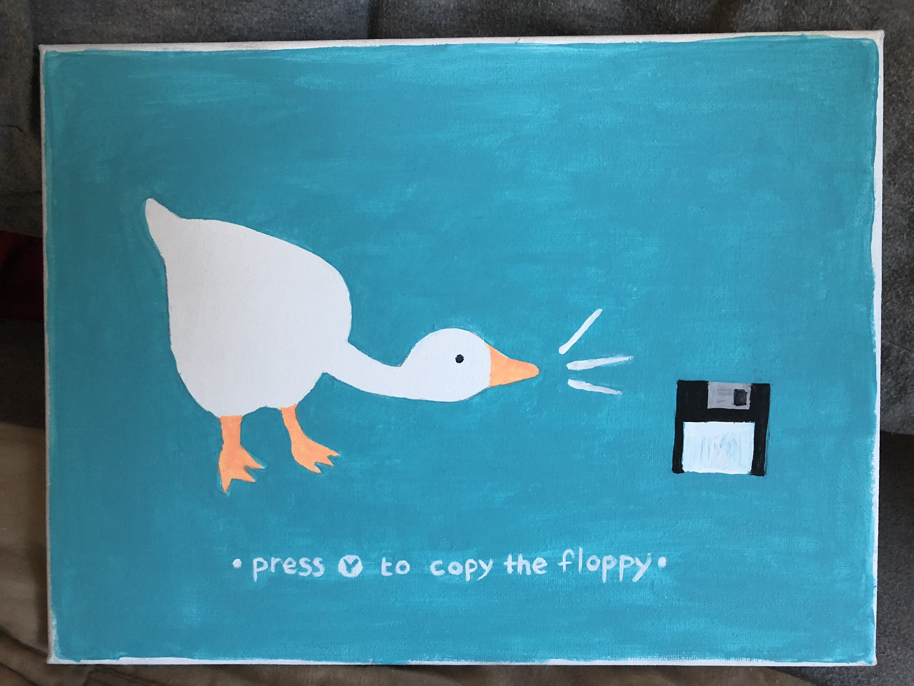

# Stego 3 (Hard)
## We have obtained a suspicious image that seems much larger than it should be. We believe that there may be additional data hidden within. Conduct an analysis and see what you can find.


- How many unique images (excluding thumbnails) can you find from this file?
- What is the flag hidden in the image?

---

### How many unique images (excluding thumbnails) can you find from this file?
To begin, there are two key pieces of information that we can gather.
1. The description says that the image is much larger than it should be.
2. The first question is how many unique images are in the file.

From this we can tell that other files are stored within this file. The first tool that we can look at is called **Binwalk**. It is used for identifying files and code inside of other files. It uses a compbination of [magic bytes](https://en.wikipedia.org/wiki/List_of_file_signatures) and custom attributes to detect files stored within another file. More about it can be found [here](https://tools.kali.org/forensics/binwalk).

```
$ binwalk Stego3.jpg

DECIMAL       HEXADECIMAL     DESCRIPTION
--------------------------------------------------------------------------------
0             0x0             JPEG image data, JFIF standard 1.01
402           0x192           Copyright string: "Copyright Apple Inc., 2017"
372014        0x5AD2E         JPEG image data, JFIF standard 1.01
372396        0x5AEAC         Copyright string: "Copyright (c) 1998 Hewlett-Packard Company"
434719        0x6A21F         JPEG image data, JFIF standard 1.01
559080        0x887E8         JPEG image data, JFIF standard 1.01
559110        0x88806         TIFF image data, big-endian, offset of first image directory: 8
595062        0x91476         JPEG image data, JFIF standard 1.01
675365        0xA4E25         JPEG image data, JFIF standard 1.01
```

Excluding the original image, we can see that there are 5 other JPEG's stored within the file. <br>
`5`

### What is the flag hidden in the image?
Use Binwalk to extract all the images found.
```
$ binwalk --dd='.*:.jpg' Stego3.jpg
$ ls -la ./_Stego3.jpg.extracted/
total 3504
-rw-r--r-- 1 root root 793380 Nov  6 12:14 0.jpg
-rw-r--r-- 1 root root 792978 Nov  6 12:14 192.jpg
-rw-r--r-- 1 root root 421366 Nov  6 12:14 5AD2E.jpg
-rw-r--r-- 1 root root 420984 Nov  6 12:14 5AEAC.jpg
-rw-r--r-- 1 root root 358661 Nov  6 12:14 6A21F.jpg
-rw-r--r-- 1 root root 234300 Nov  6 12:14 887E8.jpg
-rw-r--r-- 1 root root 234270 Nov  6 12:14 88806.jpg
-rw-r--r-- 1 root root 198318 Nov  6 12:14 91476.jpg
-rw-r--r-- 1 root root 118015 Nov  6 12:14 A4E25.jpg
```

The files are named after their hex location so just open all the filenames that match the JPEG locations given in the first question. The flag is found in the '887E8.jpg' file. <br>
`SKY-HONK-2214`

Notes:
- The TIFF file looks to be a false positive. I wasn't able to open the file so I'm not sure.
- `--dd='.*:.jpg'` - Carves out all of the files. `.*` means to carve out all types of files and `.jpg` means to append that extension. Format is `-dd='type:ext'`