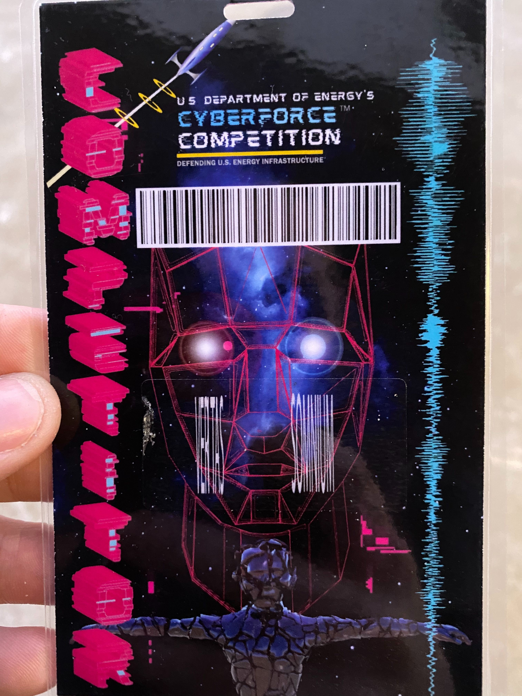
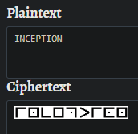
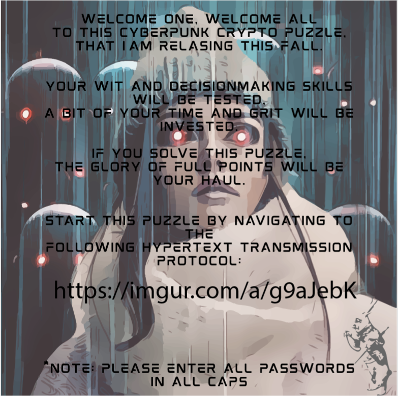
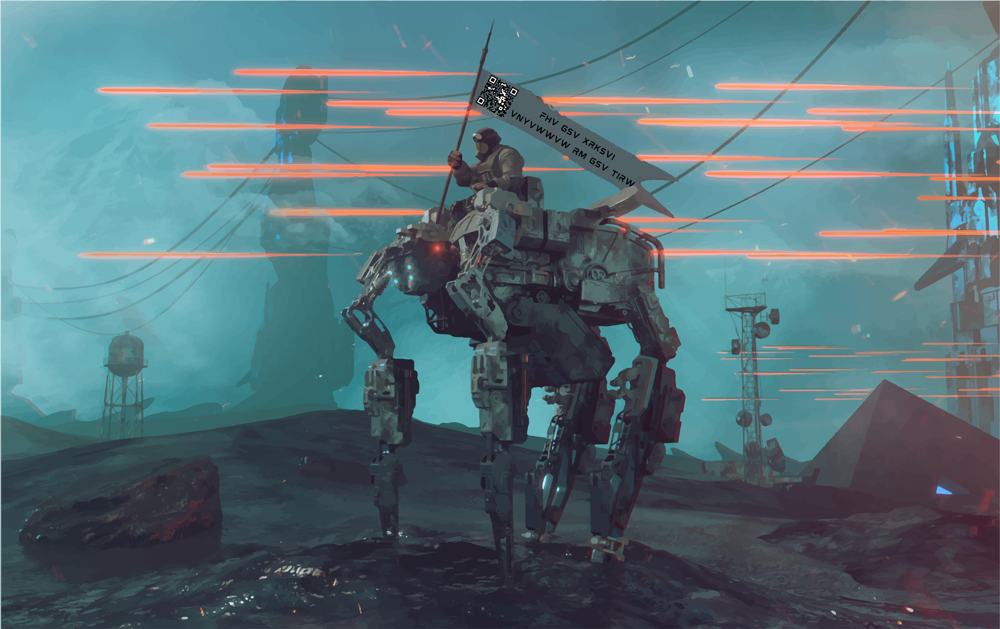
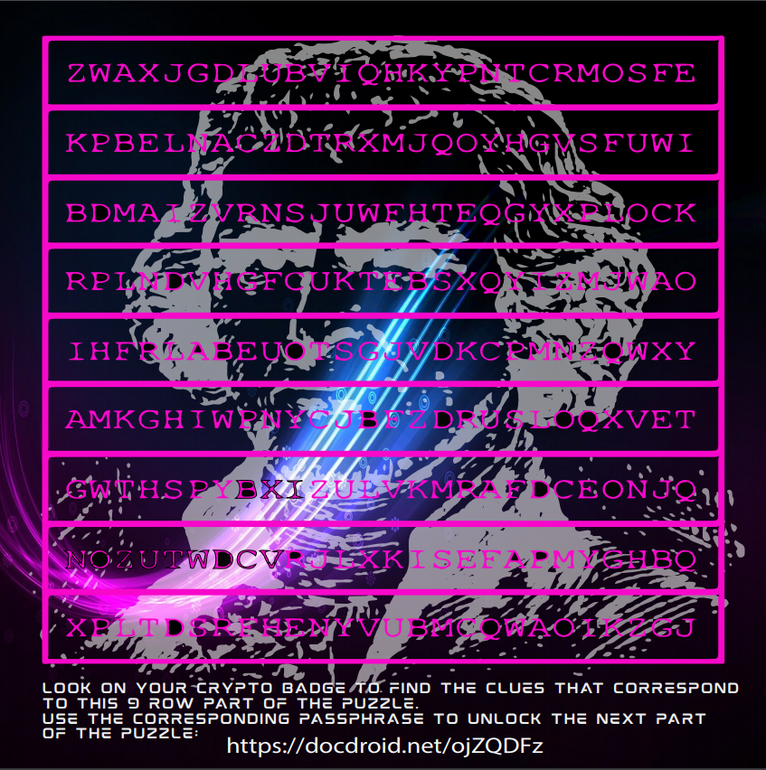
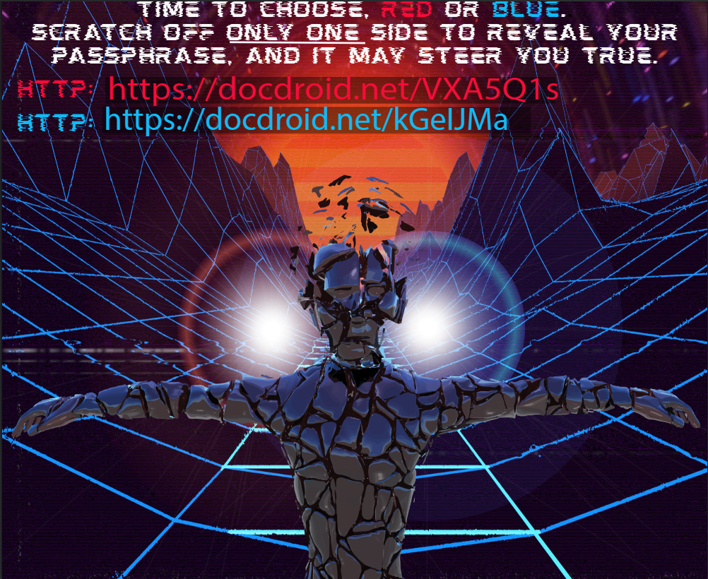
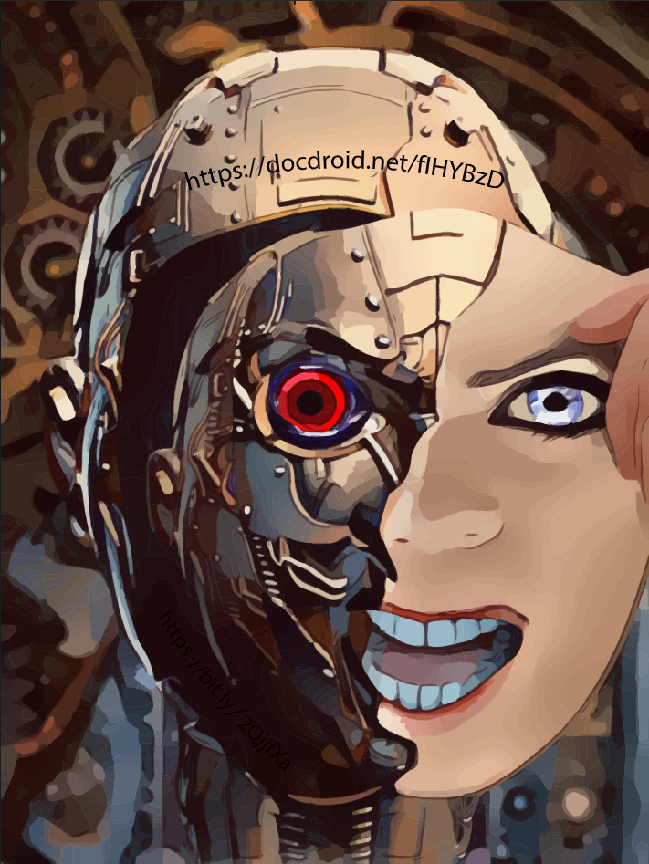

# ANL CyberForce - Badge Challenge

We start out with the badge

### Front of Badge


### Back of Badge



One of the first things that popped out to me was the pigpen cipher located at the bottom of the front side. I went ahead and deciphered that to use later.

I chose to read it from left to right, top to bottom and shifting the image up towards me. 


I ended up using an online [decoder](https://www.boxentriq.com/code-breaking/pigpen-cipher) to solve the cipher.



Our plaintext is `INCEPTION`.

Let's file that away for now and look at the next most tantalizing thing... Barcodes!

Use your favorite scanner and it will decode to <br>
`https://bit.ly/2lMnBJs` <br>

That link will forward you to a soundcloud page with some stupid audio that I can't understand at all and wasted too much time trying to figure out... But no, I'm not salty at all.<br>
`https://soundcloud.com/user-373012117-481744180/the_beginning`

Also, I spent a lot of hours messing with the letters and numbers on the front of the badge but found out later that it wasn't possible to advance without the anomolies we were given the next day...


Next day we get the list of anaomolies and #1 has to do with our badge. We are given a PDF with more directions. Here are our directions...



So...
1. All codes will be uppercase.
2. FOLLOW THAT LINK!

`https://imgur.com/a/g9aJebK`



We will focus in on the ciphertext and QR code


Scanning the QR code... Well...
https://www.youtube.com/watch?v=L18fPGfPjlU

Moving on, let's take a look at the ciphertext. <br>
`FHV GSV XRKSVI VNYVWWVW RM GSV TIRW`

We will go ahead and throw it into [CyberChef](https://gchq.github.io/CyberChef/) and try out some of the decoders. Try all the ones that don't require some sort of key.
1. ROT13: Amount 1-25... Nothing :(
2. XOR Bruteforce: Nothing :(
3. Atbash... *There it is!!*

Decoding with atbash will give us the plaintext `USE THE CIPHER EMBEDDED IN THE GRID`

There are a couple of directions I went here but decided to run Dominic Breuker's [stego-toolkit](https://github.com/DominicBreuker/stego-toolkit) docker image. This will run some basic image forensics and is super usefull for pretty much all CTF image forensic challenges.

*Make sure Docker is installed. Instructions [here](https://lmgtfy.com/?q=how+to+install+docker).

Run:
```
$ docker pull dominicbreuker/stego-toolkit

$ docker run -v /root/Downloads:/data -it dominicbreuker/stego-toolkit /bin/bash

$ check_jpg.sh name_of_image.jpg

-----INFO-------
-v /root/Downloads:/data        : Mount a local directory from the host onto the container.
                                  Change it depending on what you need.

```

Unfortuneatly, we don't find anything too interesting from that.

But the message said to use the cipher from the grid on the badge. So let's go ahead and try steghide using `INCEPTION` as the password.

```
$ steghide extract -sf name_of_image.jpg
```

IT WORKS!!!
Our image is extracted and wrote to `stego1.jpg`


https://docdro.id/tjwUQOO

Opening the link and entering `INCEPTION` gives us our next challenge.



Transcript:
```
ZWAXJGDLUBVIQHKYPNTCRMOSFE
KPBELNACZDTRXMJQOYHGVSFUWI
BDMAIZVRNSJUWFHTEQGYXPLOCK
RPLNDVHGFCUKTEBSXQYIZMJWAO
IHFRLABEUOTSGJVDKCPMNZQWXY
AMKGHIWPNYCJBFZDRUSLOQXVET
GWTHSPYBXIZULVKMRAFDCEONJQ
NOZUTWDCVRJLXKISEFAPMYGHBQ
XPLTDSRFHENYVUBMCQWAOIKZGJ
```

Looking at the background, I figured that that was probably Thomas Jefferson and may be a reference to a [Jefferson Wheel Cipher](https://www.monticello.org/site/research-and-collections/wheel-cipher).

We can write a script to do the decoding for us
```python
# Enter each line of our wheel into the array
cipherArray = ['ZWAXJGDLUBVIQHKYPNTCRMOSFE','KPBELNACZDTRXMJQOYHGVSFUWI','BDMAIZVRNSJUWFHTEQGYXPLOCK','RPLNDVHGFCUKTEBSXQYIZMJWAO','IHFRLABEUOTSGJVDKCPMNZQWXY','AMKGHIWPNYCJBFZDRUSLOQXVET','GWTHSPYBXIZULVKMRAFDCEONJQ','NOZUTWDCVRJLXKISEFAPMYGHBQ','XPLTDSRFHENYVUBMCQWAOIKZGJ']

# Enter the numerical key
key = [8,5,7,3,1,4,2,9,6]

# Enter ciphertext
cipherText = 'REMTWVHUM'

for i in range(len(key)):
    x = key[i] - 1
    while cipherArray[x][0] != cipherText[i]:
        cipherArray[x] = cipherArray[x][1:] + cipherArray[x][0]

for i in range(26):
    for j in range(len(key)):
        print(cipherArray[key[j] - 1][i], end="")
    print("")
```
Running that script gives us the output
```
REMTWVHUM
JUREAHGBK
LOAQXGVMG
XTFGJFSCH
KSDYGCFQI
IGCXDUUWW
SJEPLKWAP
EVOLUTION   <----
FDNOBEKIY
AKJCVBPKC
PCQKISBZJ
MPGBQXEGB
YMWDHQLJF
GNTMKYNXZ
HZHAYIAPD
BQSIPZCLR
QWPZNMZTU
NXYVTJDDS
OYBRCWTSL
ZIXNRARRO
UHISMOXFQ
TFZJORMHX
WRUUSPJEV
DLLWFLQNE
CAVFENOYT
VBKHZDYVA
```

We can see that `EVOLUTION` is the only word that stands out to us so lets use that as the password for the next document.

`https://docdroid.net/ojZQDFz`

Once we enter `EVOLUTION` as the password, we are presented with a choice



```
RED:  https://docdroid.net/VXA5Q1s
BLUE: https://docdroid.net/kGeIJMa
```

Obviously we have to go with RED because... Why not!?!?

We are presented with another PDF


```
https://docdroid.net/fIHYBzD  <-- Link to our next PDF
https://bit.ly/2QjjfXa  <-- Link to COMPUTING MACHINERY AND INTELLIGENCE paper by Allen Turing
```

In our next PDF called `Red.pdf`, it asks for a password. Looking back at our where our path forked, it says to "scratch off only one side to reveal your passphrase." Looking at the back of our badge, we see two words underneath two sets of *colored* eyes. We enter the passphrase given underneath the red eye (`VERITAS`) and find that it lets us in.


`https://www.docdroid.net/zrzT6Tm` <br><br>
Right away, you can tell that those numbers most likely reffer to some page, line number, word, letter in that word. In case you didn't recognize that, they left a hint on how to interpret the numbers.
```
-cntr ahzore
-yvar ahzore
-jbeq ahzore
-yrggre ahzore

---> ROT13 --->

-page number
-line number
-word number
-letter number
```

Page Number | Line Number | Word Number | Letter Number | Final Letter
---|---|---|---|---
1|1|12|1|B
2|1|1|1|A
3|1|5|1|B
3|3|1|2|B
4|5|1|1|A
5|3|3|3|G
6|2|1|3|E

`BABBAGE` is our final code. Sounds like it could be right because it's probably a reference to Charles Babbage who is is sometimes reffered to as the 'father of computers.'

Open the link given in last PDF and enter `BABBAGE` for the password.

The PDF is named `Finitium.pdf` which implies that this may be the end of the puzzle.

We are given some simple text with a YouTube link.
 <br>
`https://youtu.be/xfqawxSLLhQ`

Clicking the link gives us a brief message and then our flag!


`SENTIENCE` is our flag.


